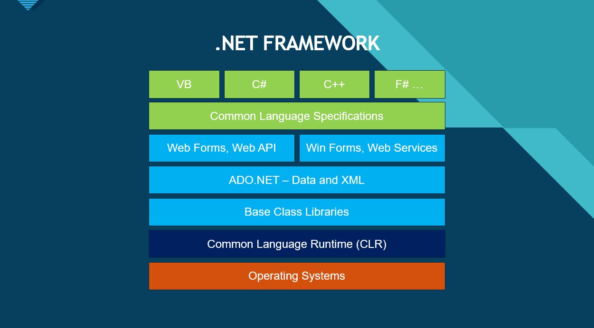

# Welcome to C#

## Intro to the .NET Ecosystem

Made by: Luke Matheis

---

## What is C#?

* Created by Anders Hejlsberg at Microsoft in 2000.
    - Five years after the first release of Java.
* Strictly Typed, C styled. Also supports `null` safety.
* Object-Oriented (OOP): Focuses on classes and objects.
* Versatile:
    - Web (ASP.NET Core)
    - Mobile (.NET MAUI)
    - Gaming (Unity)
    - Cloud (Azure)

---

## What is .NET?

* A FOSS (Free and Open Source Software) framework developed by Microsoft that provides a platform for building and running applications.
* It is not tied to a specific language, but C# is the most popular language for .NET development.
* It currently supports; C#, F#, and Visual Basic.

---



<!-- Talk about how C# code compiles to IL (Intermediate Language) and runs on the CLR -->

---

## The Evolution of .NET

| Era        | Version               | Support                                           |
| :--------- | :-------------------- | :------------------------------------------------ |
| Past       | .NET Framework (4.8)  | Windows Only (Legacy)                             |
| Transition | .NET Core (1.0 - 3.1) | Cross-Platform Revolution                         |
| Modern     | .NET 5 / 6 / 8+       | One Unified Platform, (Dropped the "Core" naming) |

Microsoft is great at naming things, cough cough Xbox.

---

## C# vs. Java: The High-Level View

| Feature    | C#                                   | Java                                  |
| :--------- | :----------------------------------- | :------------------------------------ |
| Parent     | Microsoft                            | Sun Microsystems (Oracle)             |
| Runtime    | CLR (Common Language Runtime)        | JVM (Java Virtual Machine)            |
| Properties | Built-in get; set; syntax            | Requires manual Getter/Setter methods |
| LINQ       | Powerful native data querying        | Uses "Streams" (added later)          |
| Async      | async/await is a first-class citizen | More boilerplate required             |

---

## Syntax Variables
Both use static typing, but C# introduced var earlier for brevity.

Java
```java
int score = 100;
String message = "Hello";
```

C#

```csharp
int score = 100;
string message = "Hello"; // lowercase 'string' is an alias
var score2 = 100; // var is implicitly typed
```

* var is implicitly typed but still strictly typed by the compiler.
* C# provides lowercase aliases for types (int, string, bool).

---

## Syntax Conditionals

The logic is identical, but watch the console naming and uppercase 'B' in bool.

Java:

```java
boolean isActive = true;
if (score > 90 && isActive) {
    System.out.println("A+");
} else {
    System.out.println("Keep trying");
}

```

C# : 

```csharp
bool isActive = true;
if (score > 90 && isActive) {
    Console.WriteLine("A+");
} else {
    Console.WriteLine("Keep trying");
}

```

---

