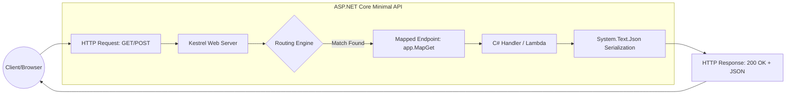

# C# Web API

## API Diagram



## Creating a Project

```bash
dotnet new webapi -o FortuneCookie --use-controllers
cd FortuneCookie
dotnet run
```

## Testing the API

The project will give us a simple weather forecast API.
Test it out at `https://localhost:[PORT]/weatherforecast` or `http://localhost:[PORT]/openapi/v1.json`.

> Talk about how we will add a UI to OpenAPI later.

## Customizing the API

Add a new controller to the `Controllers` folder called [`OracleController.cs`](./Controllers/OracleController.cs)

Now look at the updated openapi spec.
Notice it automatically updated.
