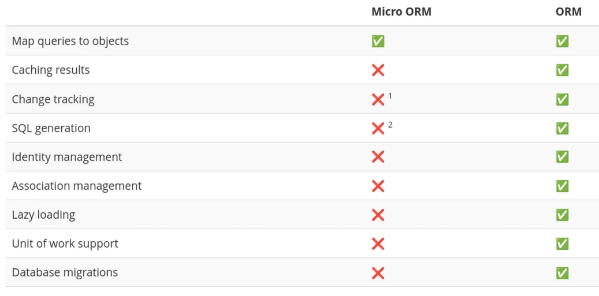

# Adding a Database to our API

Using Dapper to connect to a SQLite database

By: Luke Matheis

---

## SQLite

* Self-contained and serverless database engine
  - Zero outside dependencies.
* Stored as a single cross-platform file on disk
* Zero configuration required to start development
* Ideal for local storage and smaller-scale web APIs
* Integrated easily via Microsoft.Data.Sqlite package

---

## SQL Refresher

| Command | Purpose | Example |
| --- | --- | --- |
| CREATE TABLE | Defines a new table and columns | CREATE TABLE PowerUps (...) |
| INSERT INTO | Adds new rows to a table | INSERT INTO PowerUps (Name) VALUES (...) |
| SELECT | Retrieves data from the database | SELECT * FROM PowerUps WHERE Id = 1 |
| WHERE | Filters results based on a condition | WHERE Category = 'Offensive' |

---

## SQLite Data Types

| Type/Constraint | Description |
| --- | --- |
| INTEGER | Numeric values (use long in C# for PKs) |
| TEXT | String or character data |
| PRIMARY KEY | Uniquely identifies each record |
| AUTOINCREMENT | Automatically increments the ID value |
| NOT NULL | Ensures the column cannot be empty |
| REAL | Floating point or decimal numbers |
| BOOLEAN | True/False values (stored as 0/1) |

---

---

### Micro-ORM vs Entity Framework

* Dapper is high performance and very close to raw SQL
* EF is a full Object-Relational Mapper with more abstraction
* Dapper requires writing manual SQL queries
* EF generates SQL automatically based on C# LINQ code
* Dapper is lightweight with minimal memory overhead
* EF provides  migrations

---
