# API + DB

This is a 3 day lecture example.
Split into 2 parts.

## Part 1: Console App

We will start with using a web API template.
We will just ignore the API part for now and build a console app for now.
This is easier then converting a console app to a web API later.

```bash
dotnet new webapi -n RetroGameApp
cd RetroGameApp
dotnet add package Microsoft.EntityFrameworkCore.Sqlite
dotnet add package Dapper
dotnet add package Microsoft.AspNetCore.OpenApi
dotnet add package Scalar.AspNetCore
```

- Build out the Model
- Build out the Repository
- Build out the Console App in `ConsoleApp.cs`
- Call the Console App from `Program.cs`

```csharp
ConsoleApp app = new ConsoleApp();
app.Run();
```

## Part 2: Convert to Web API

- Add Controller
- Wire Up `Program.cs` to use the Repository and Controller
    - Replace the console app with the API version of Program.cs
- Test with Scalar UI: http://localhost:5000/scalar
- Look at the OpenAPI JSON: http://localhost:5000/openapi/v1.json

## Data flow

```mermaid
sequenceDiagram
    participant Client as Client (Browser/Scalar)
    participant Ctrl as GamesController
    participant DTO as GameSearchDto
    participant Repo as GameRepository
    participant Dapper as Dapper / SQLite
    participant DB as retro_games.db

    Note over Client, Ctrl: HTTP GET /api/games/search?platform=NES
    Client->>Ctrl: Request with Query Params

    rect rgb(40, 40, 40)
    Note right of Ctrl: Map Params to DTO
    Ctrl->>DTO: Create(platform, genre)
    end

    Ctrl->>Repo: GetByFilter(searchDto)

    rect rgb(60, 60, 60)
    Note right of Repo: Generate SQL string
    Repo->>Dapper: Query<VideoGame>(sql, searchDto)
    Dapper->>DB: SELECT * FROM Games WHERE...
    DB-->>Dapper: Raw Data Rows (Int64, Text, etc)
    Dapper-->>Repo: List<VideoGame> (C# Records)
    end

    Repo-->>Ctrl: IEnumerable<VideoGame>

    rect rgb(40, 40, 40)
    Note right of Ctrl: Wrap in Results.Ok()
    Ctrl-->>Client: 200 OK (JSON Array)
    end
```


