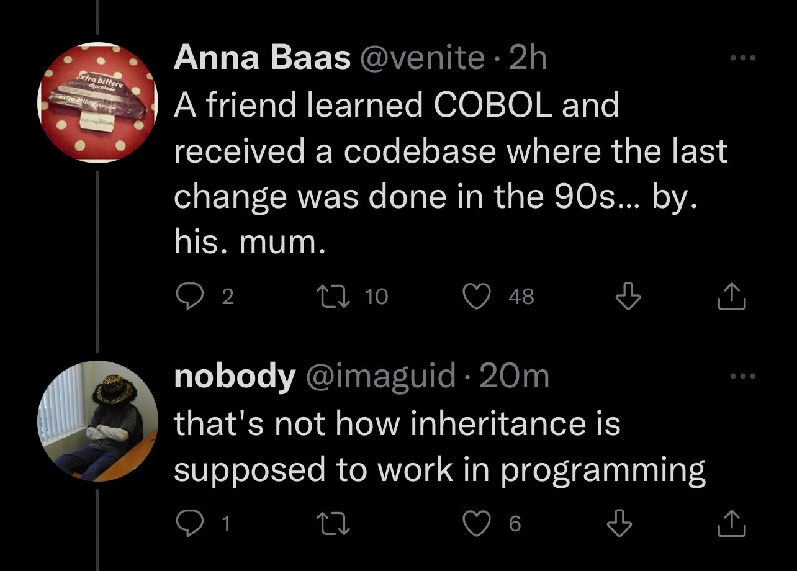

# Inheritance

By: Luke Matheis

---

## What is inheritance?

Just as you might inherit your eyes from a parent, a class in C# can inherit behavior and data from another class.

It lets us create a general version of something (like a Vehicle) and then make specific versions (like a Truck or a Bike) without starting from scratch every time.

---

## Syntax

In C#, we use a colon to say "this class is a child of that class."

```csharp
class Animal {
  public void Eat() {
    Console.WriteLine("Munch munch...");
  }
}

class Dog : Animal {
  public void Bark() {
    Console.WriteLine("Woof!");
  }
}

```

---



---

## Shared vs. Private

Not everything is shared with the kids. We use labels to decide who sees what:

* public: Anyone can see it.
* private: Only the parent can see it.
* protected: Only the parent and the children can see it.

---

## Changing the rules

In C# children by default inherit everything from their parent, but they can choose to change how some things work. This is called overriding. To allow this, the parent class must mark the method as virtual.

---

## Overriding Syntax

```csharp
class Animal {
  public virtual void Speak() {
    Console.WriteLine("Some sound...");
  }
}

class Dog : Animal {
  public override void Speak() {
    Console.WriteLine("Woof!");
  }
}
```

---

## The base keyword

If a child class wants to use its parent's version of a method while also doing its own thing, it uses the base keyword.

It is like saying, "Do what my parent does, and then do this extra step."

---

## A few ground rules

C# is strict about a couple of things:

1. A class can only have one direct parent. No "double inheritance."
2. If you mark a class as sealed, it is like a dead end—no one can inherit from it.
3. If a method is marked as virtual, it can be overridden. If it's not, then it can't be changed by the child classes.

---

