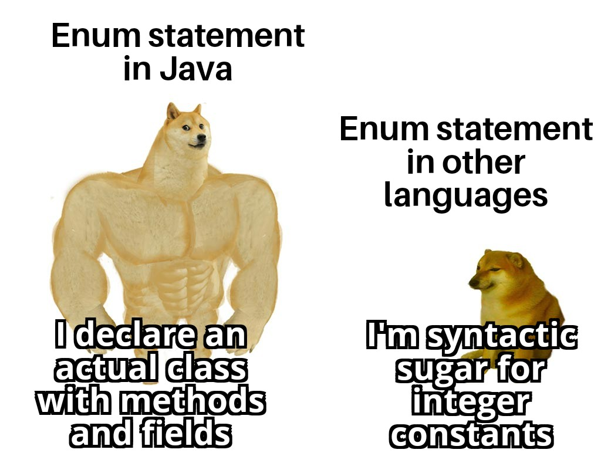

# Enumerations

By: Luke Matheis


---


----

## Enums

* Enumerations are a distinct value type in C# that allow you to create a set of named constants.
* Instead of using magic numbers or strings to represent a state, enums provide a type-safe way to manage related items.
* Under the hood, an enum is backed by an integral type, such as `int`, `string`, or `double`.

---

## Basic Syntax 

To define an enum, use the `enum` keyword. 
By default, the first item is assigned the value 0, and each subsequent item increases by 1.

```csharp
public enum OrderStatus
{
    Pending,   // 0
    Shipped,   // 1
    Delivered, // 2
    Cancelled  // 3
}

```

---

## Explicit Value Assignment

You can also explicitly assign values:

```csharp
public enum ErrorCode
{
    None = 0,
    NotFound = 404,
    ServerError = 500
}

```

---

# How Enums Work in Logic

Enums are used to make code more readable and less prone to errors. 
Don't need to litter your code with magic numbers or strings that can be mistyped.

```csharp
OrderStatus currentStatus = OrderStatus.Shipped;

if (currentStatus == OrderStatus.Shipped)
{
    Console.WriteLine("Your package is on the way.");
}
```

---

## Practical Advantages

* Type Safety: You cannot accidentally pass an arbitrary integer to a method expecting a specific enum type.
* Intellisense Support: IDEs provide a list of available options, reducing typos.
* Maintainability: If you need to change a value, you change it in one place (the definition) rather than searching through the entire codebase for specific numbers.
* Documentation: The code becomes self-documenting; OrderStatus.Delivered is much clearer than the number 2.

---

# Comparing C# Enums and Java Enums

* In C#, an enum is a value type. 
* It is essentially a named constant for an underlying integral type (like int or byte). 
* It lives on the stack and is very lightweight.

* In Java, an enum is a full-fledged class that extends `java.lang.Enum`. 
* Every constant in a Java enum is an instance of that enum class. 

---

# Methods and Fields

Because Java treats enums as classes, you can define fields, constructors, and methods directly inside the enum body.

```java
// Java example
public enum Planet {
    EARTH(5.97), MARS(0.64);
    private final double mass;
    Planet(double mass) { this.mass = mass; }
    public double getMass() { return mass; }
}

```

You can't do this in C#.

---

# Summary of Key Differences

| Feature | C# Enums | Java Enums |
| --- | --- | --- |
| Type System | Value Type (struct) | Reference Type (class) |
| Methods/Fields | No (use extensions) | Yes |
| Inheritance | Inherits from System.Enum | Inherits from java.lang.Enum |
| Performance | Extremely low overhead | Object-level overhead |

---

