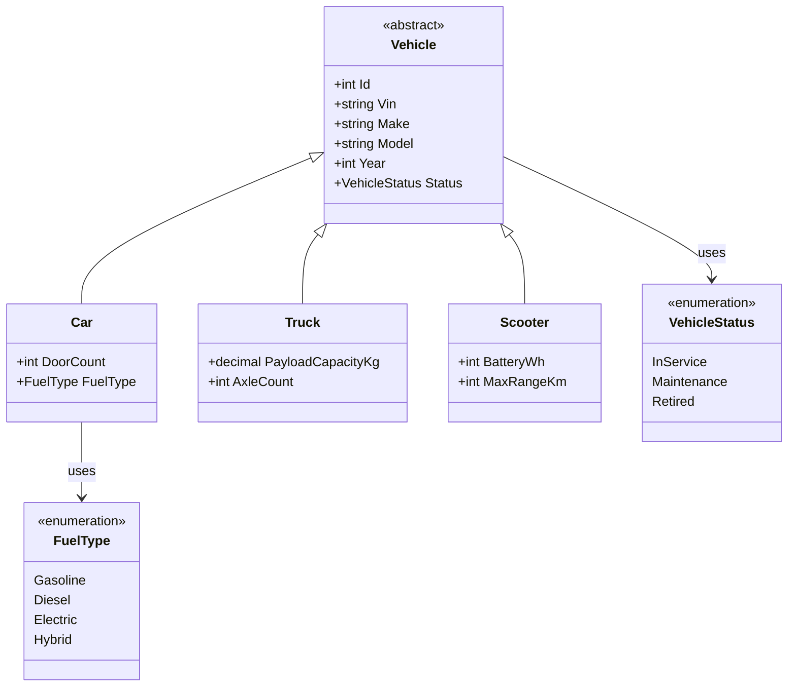
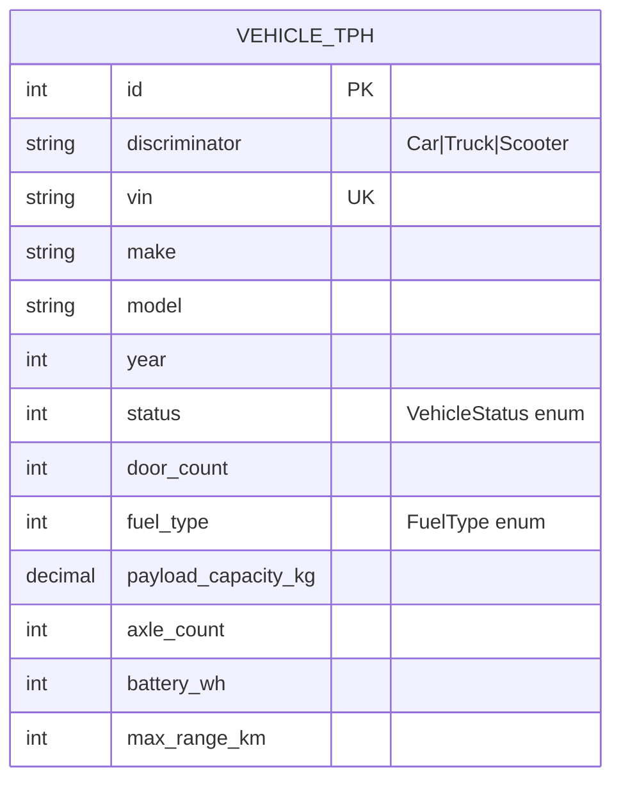
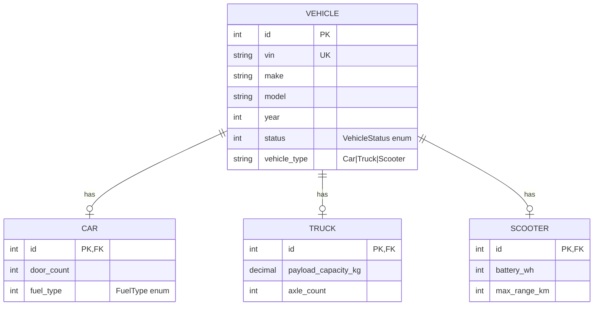
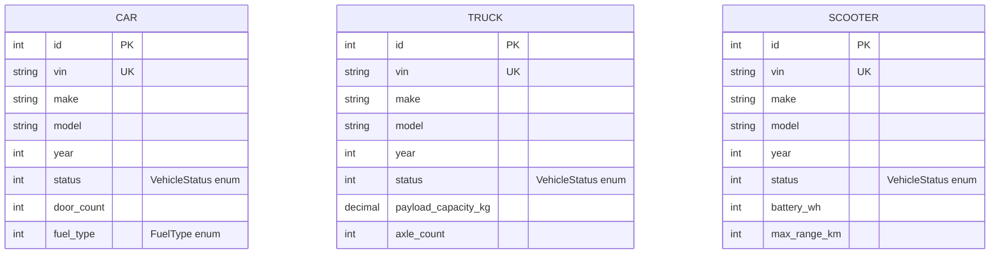

# Database Design

As our data models grow more complex so do our database schemas.
There isn't just one way to design a database for an inheritance hierarchy, there are multiple approaches each with their own trade-offs.

Inheritance Mapping Strategies

- TPH (Table Per Hierarchy)
- TPT (Table Per Type)
- TPC (Table Per Concrete Class)

## C# Models

Below is a example C# class hierarchy.
Have students write the C# code.

- [Code](./Models.cs)

### C# Model as a UML Class Diagram

## Approach 1: TPH (Table Per Hierarchy)

All vehicle types are stored in one table with a discriminator column.

Pros:

- Simplest queries for full hierarchy reads.
- Fewer joins.

Cons:

- Many nullable subtype columns.
- Harder to enforce subtype-specific required fields.

Example subtype rules (application or DB constraints):

- If `discriminator = 'Car'`, then `door_count` and `fuel_type` are required.
- If `discriminator = 'Truck'`, then `payload_capacity_kg` and `axle_count` are required.
- If `discriminator = 'Scooter'`, then `battery_wh` and `max_range_km` are required.

## Approach 2: TPT (Table Per Type)

Base fields go in a parent table. Each subtype gets its own table keyed by the same ID.

Pros:

- Cleaner schema with fewer nulls.
- Stronger structural correctness for subtype fields.

Cons:

- More joins for polymorphic reads.
- Slightly more complex write operations.

## Approach 3: TPC (Table Per Concrete Class)

Each concrete type has its own full table with duplicated base columns.

Pros:

- No joins for subtype-specific reads.
- No nullable subtype fields.

Cons:

- Duplicated base schema across tables.
- Cross-type queries require `UNION`.

## Excalidraw Diagram

- [Diagram](./diagram.png)
    - [Source](./diagram.excalidraw)
    - [Svg](./diagram.svg)

## Next Time: EF

Next lecture we will talk about Entity Framework.
We will move past writing raw SQL by hand and have EF generate our SQL for us.
We will still need to design our database schema, so it is important to understand these different approaches to mapping.
