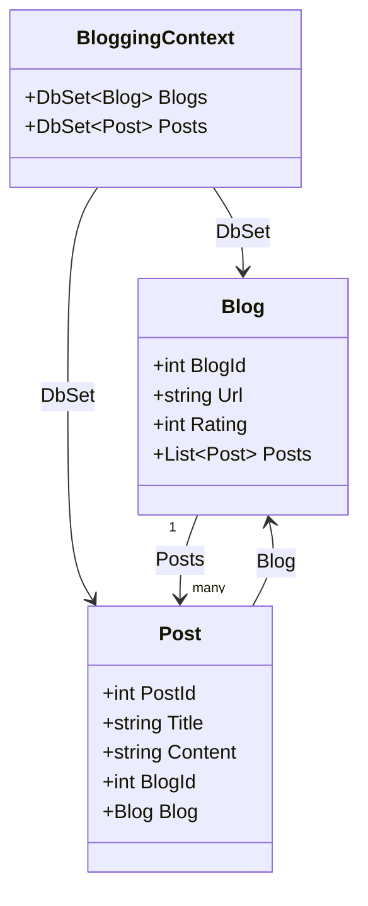
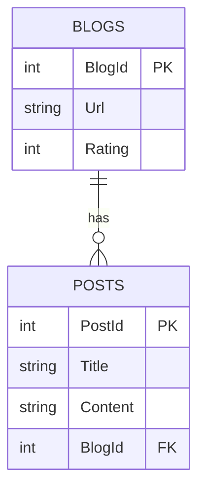

### Class Diagram (C# Model)

```mermaid
classDiagram
    class BloggingContext {
        +DbSet~Blog~ Blogs
        +DbSet~Post~ Posts
    }

    class Blog {
        +int BlogId
        +string Url
        +int Rating
        +List~Post~ Posts
    }

    class Post {
        +int PostId
        +string Title
        +string Content
        +int BlogId
        +Blog Blog
    }

    BloggingContext --> Blog : DbSet
    BloggingContext --> Post : DbSet
    Blog "1" --> "many" Post : Posts
    Post --> Blog : Blog
```

### ER Diagram (Database Output)

```mermaid
erDiagram
    BLOGS {
        int BlogId PK
        string Url
        int Rating
    }

    POSTS {
        int PostId PK
        string Title
        string Content
        int BlogId FK
    }

    BLOGS ||--o{ POSTS : has
```
