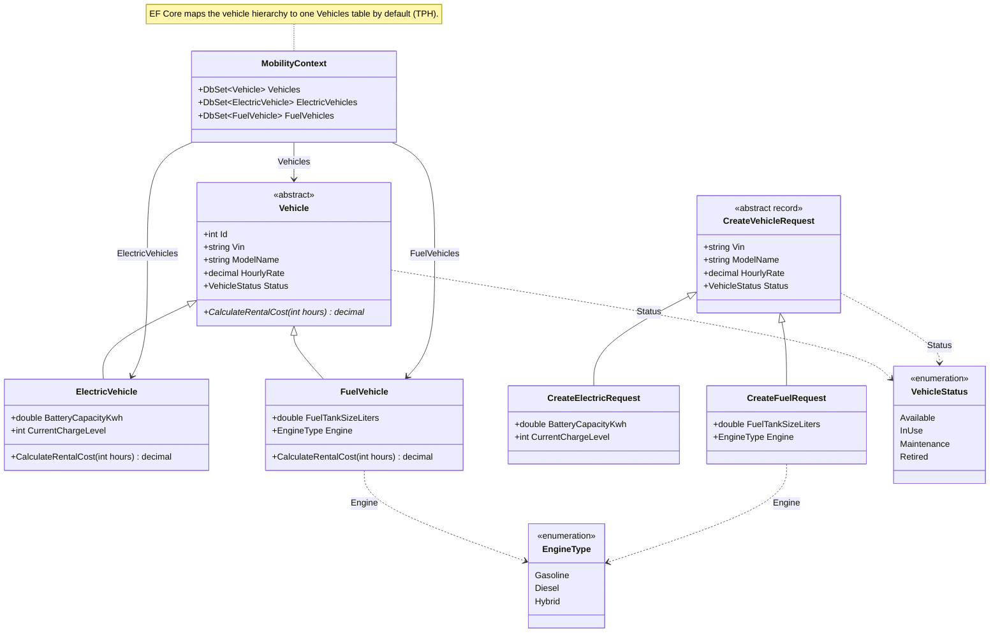

```mermaid
classDiagram
    class Vehicle {
        <<abstract>>
        +int Id
        +string Vin
        +string ModelName
        +decimal HourlyRate
        +VehicleStatus Status
        +CalculateRentalCost(int hours) decimal*
    }

    class ElectricVehicle {
        +double BatteryCapacityKwh
        +int CurrentChargeLevel
        +CalculateRentalCost(int hours) decimal
    }

    class FuelVehicle {
        +double FuelTankSizeLiters
        +EngineType Engine
        +CalculateRentalCost(int hours) decimal
    }

    class MobilityContext {
        +DbSet~Vehicle~ Vehicles
        +DbSet~ElectricVehicle~ ElectricVehicles
        +DbSet~FuelVehicle~ FuelVehicles
    }

    class CreateVehicleRequest {
        <<abstract record>>
        +string Vin
        +string ModelName
        +decimal HourlyRate
        +VehicleStatus Status
    }

    class CreateElectricRequest {
        +double BatteryCapacityKwh
        +int CurrentChargeLevel
    }

    class CreateFuelRequest {
        +double FuelTankSizeLiters
        +EngineType Engine
    }

    class VehicleStatus {
        <<enumeration>>
        Available
        InUse
        Maintenance
        Retired
    }

    class EngineType {
        <<enumeration>>
        Gasoline
        Diesel
        Hybrid
    }

    Vehicle <|-- ElectricVehicle
    Vehicle <|-- FuelVehicle
    CreateVehicleRequest <|-- CreateElectricRequest
    CreateVehicleRequest <|-- CreateFuelRequest
    MobilityContext --> Vehicle : Vehicles
    MobilityContext --> ElectricVehicle : ElectricVehicles
    MobilityContext --> FuelVehicle : FuelVehicles
    Vehicle ..> VehicleStatus : Status
    CreateVehicleRequest ..> VehicleStatus : Status
    FuelVehicle ..> EngineType : Engine
    CreateFuelRequest ..> EngineType : Engine
    note for MobilityContext "EF Core maps the vehicle hierarchy to one Vehicles table by default (TPH)."
```
