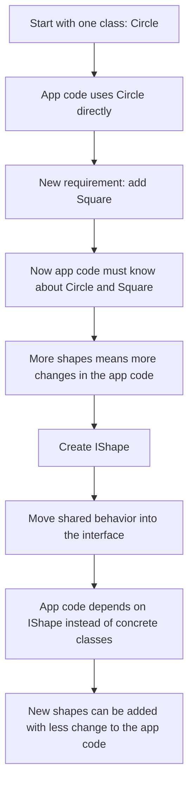
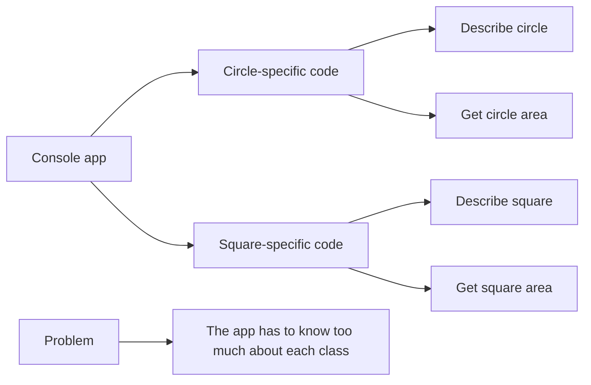
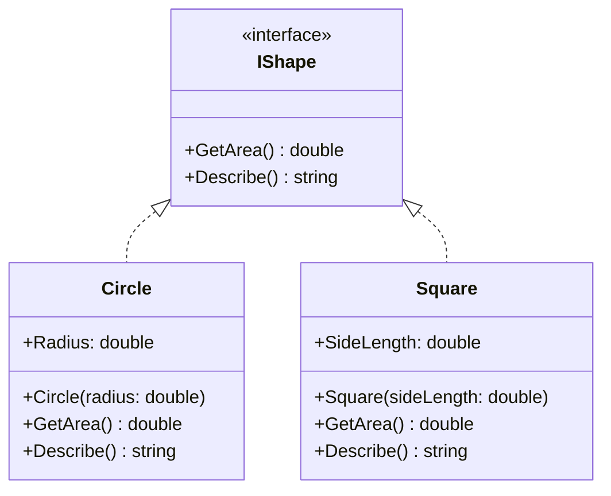
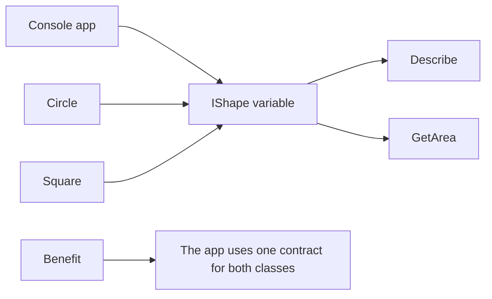

# Interface Diagram

## One Takeaway

Build an interface when multiple classes need the same behavior and you want the code using them to stay unchanged.

## 1) Why build an interface?

## 2) Where the pain is without an interface

## 3) Structure with one interface

## 4) What changes after introducing IShape

The interface couples the app together.

