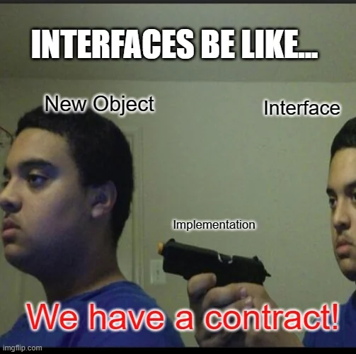
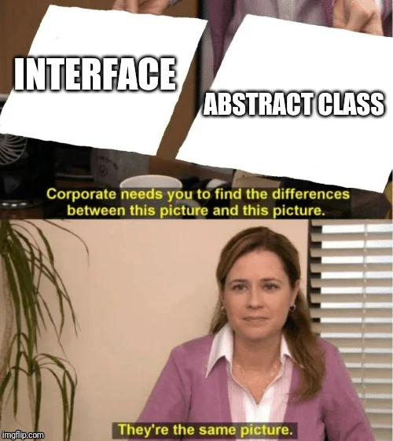

# Interfaces

## By Luke Matheis

---

## What is an Interface?

- An interface defines a **contract** for behavior.
- It says what members a type must have, but not how they work.
- Interfaces **do not** contain implementations. i.e. they only define method signatures not the actual code.
- A class can implement multiple interfaces.

---

# Syntax

```csharp
public interface ITaxCalculator
{
    double CalculateTax(double amount);
}
```

Notice that there are no method bodies. No "{ }" after the method signature.
By it's self, an interface does not do anything.
Also note there is no "public" access modifier on the methods.

---

## Why do we need Interfaces?

- Interfaces allow us to build loosely coupled applications.
- The aim is to reduce the dependencies between components of an application.
    - Meaning we can change one part of the application without affecting other parts.

---

## Contract

- Once you interface with an interface, you are agreeing to a contract.
- You are agreeing to implement all the methods defined in the interface.
    - You can not choose to implement only some of the methods. You must implement all of them.

---



---

## Interface vs Abstract Class

- Interface: defines capabilities (a contract), no shared state.
- Abstract class: provides a base to be built upon by it's subclasses.
- A class can inherit only one abstract class, but can implement many interfaces.

---


