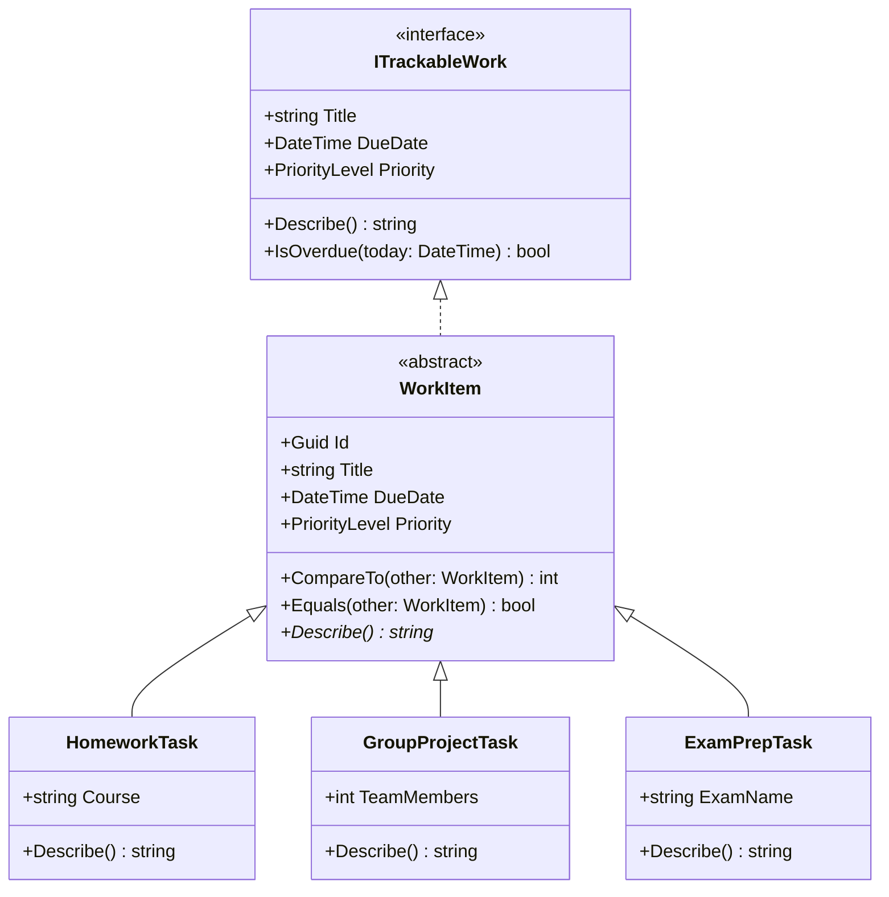

# Interface Patterns

Today is a just a bigger console example of using Interfaces.
No slideshow today just coding.
Should be able to go though this in a single lecture.
Make sure to explain that "WorkItem" is an abstract base class.

```bash
dotnet new console -n InterfacePatterns
```

## UML Diagram

Below roughly explains the hierarchy of the classes.



## Discussion Question

If we had one.
What would our database schema look like for these classes?
What inheritance mapping strategy would we use? (Table per Hierarchy, Table per Type, Table per Concrete Class)?