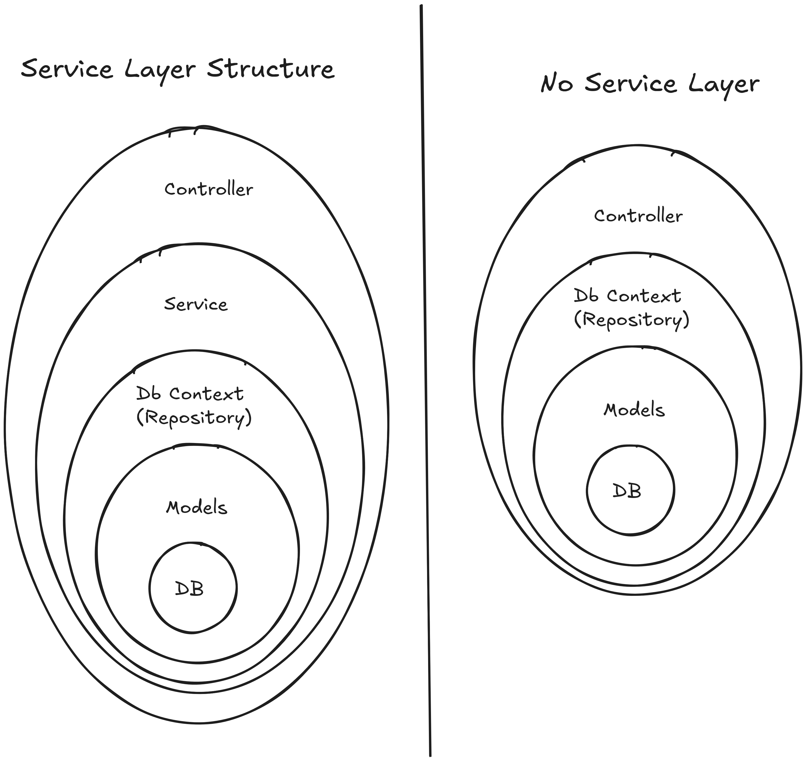

# Service Layer

We have talk a lot about interfaces.
Now lets build a API and use an interface to define the contract for our service layer.

## What is a Service Layer?

DB -> Models -> DBContext (Repository) -> Service Layer -> Controller



- [Source](./diagram/diagram.excalidraw)
- [Svg](./diagram/diagram.svg)

- Database: The actual database where data is stored.
- Models: The classes that represent the data structure of the application.
- DBContext (Repository): The layer that interacts with the database, providing methods to perform CRUD.
    - Using EF: We don't have to write the repository layer, as EF provides the methods we need so we can avoid writing boilerplate SQL.
- Service Layer: The layer that contains the business logic of the application. It acts as an intermediary between the controller and the repository.
- Controller: The API. Uses the service layer **Interface** to perform operations. Each controller should be very simple since all the business logic is in the service layer.

## Service Layer Example

This example is quite large.
It will take several lectures to build it.
Our projects now are structurally complex.
This project is what I call deep but not wide.
    - Meaning a lot of layers but not a lot of features.
    - So we can focus on the architecture and not write a lot of code.

```bash
# Create Solution
mkdir LotLogic
cd LotLogic
dotnet new sln -n LotLogic
# Create Projects
dotnet new webapi -n LotLogic.Api --use-controllers
dotnet new classlib -n LotLogic.Core
# Add Projects to Solution
dotnet sln add LotLogic.Api/LotLogic.Api.csproj
dotnet sln add LotLogic.Core/LotLogic.Core.csproj
# Add Reference
dotnet add LotLogic.Api/LotLogic.Api.csproj reference LotLogic.Core/LotLogic.Core.csproj
# Add Nuget Packages
cd LotLogic.Api
dotnet add package Microsoft.Data.Sqlite
dotnet add package Microsoft.EntityFrameworkCore.Design
dotnet add package Microsoft.AspNetCore.OpenApi
dotnet add package Scalar.AspNetCore
```
