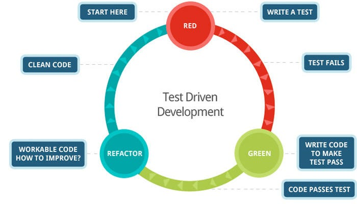

# Test Driven Development (TDD)

In C#
By Luke Matheis

---

## What is TDD?

TDD means:

1. Write a failing test first.
2. Write the smallest code to pass.
3. Refactor safely.

Repeat this loop all day.

---

## The TDD Loop

### Red -> Green -> Refactor

* Red: test fails for the right reason.
* Green: make it pass fast.
* Refactor: improve code, keep tests green.

Small steps beat big rewrites.

---



---

## TDD is Not Optional

Most workplaces expect you to write tests.

* If you don't write tests, QA won't accept your code.
* Unit tests are just part of each task.
* You will learn to love the tests.

---

## Tiny C# Example

Goal: `Add(2, 3)` should return `5`

```csharp
[Fact]
public void Add_TwoNumbers_ReturnsSum()
{
	var calc = new Calculator();
	Assert.Equal(5, calc.Add(2, 3));
}
```

Then write just enough production code to pass.

---

## Quick Start in .NET

```bash
dotnet new xunit -n Calculator.Tests
dotnet add Calculator.Tests reference Calculator.Core
dotnet test
```

---

## Wrap-Up

* TDD = Red -> Green -> Refactor
* Small tests drive better code
* Tests are your long-term safety net
* You don't always need 100% coverage.
